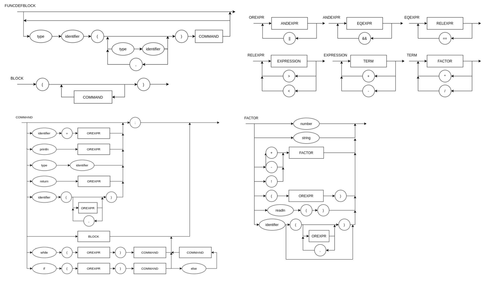

# Compilador

### Funcionamento do compilador:

Esse compilador funciona somente para argumentos de entrada que buscam calcular operações matemáticas de soma, subtração, multiplicação, divisão, atribuições a variáveis e comandos de *println*. O programa deve ser executado da seguinte forma:

~~~
python main.py "arquivo.c"
~~~

Sendo ```arquivo.c``` o arquivo que contém a equação a ser resolvida. Assim, o programa exibirá na tela como saída a resolução do programa ```arquivo.c```.

### Diagrama Sintático:



### Notação EBNF:


### EBNF Atual:

~~~
BLOCK = "{", { COMMAND }, "}" ;
COMMAND = ((λ | ASSIGNMENT | PRINT), ";" | LOOP | IF-ELSE) ;
LOOP = "while", "(", OR_EXPRESSION, ")", BLOCK ;
IF-ELSE = "if", "(", OR_EXPRESSION, ")", BLOCK, ["else", BLOCK] ;
ASSIGNMENT = IDENTIFIER, "=", (OR_EXPRESSION | READ) ;
READ = "readln", "(", ")" ;
PRINT = "println", "(", OR_EXPRESSION, ")" ;
OR_EXPRESSION = AND_EXPRESSION, { "||", AND_EXPRESSION } ;
AND_EXPRESSION = EQ_EXPRESSION, { "&&", EQ_EXPRESSION } ;
EQ_EXPRESSION = REL_EXPRESSION, { "==", REL_EXPRESSION } ;
REL_EXPRESSION = EXPRESSION, { (">" | "<"), EXPRESSION } ;
EXPRESSION = TERM, { ("+" | "-"), TERM } ;
TERM = FACTOR, { ("*" | "/"), FACTOR } ;
FACTOR = (("+" | "-"), FACTOR) | NUMBER | "(", EXPRESSION, ")" | IDENTIFIER ;
IDENTIFIER = LETTER, { LETTER | DIGIT | "_" } ;
NUMBER = DIGIT, { DIGIT } ;
LETTER = ( a | ... | z | A | ... | Z ) ;
DIGIT = ( 1 | 2 | 3 | 4 | 5 | 6 | 7 | 8 | 9 | 0 ) ;
~~~