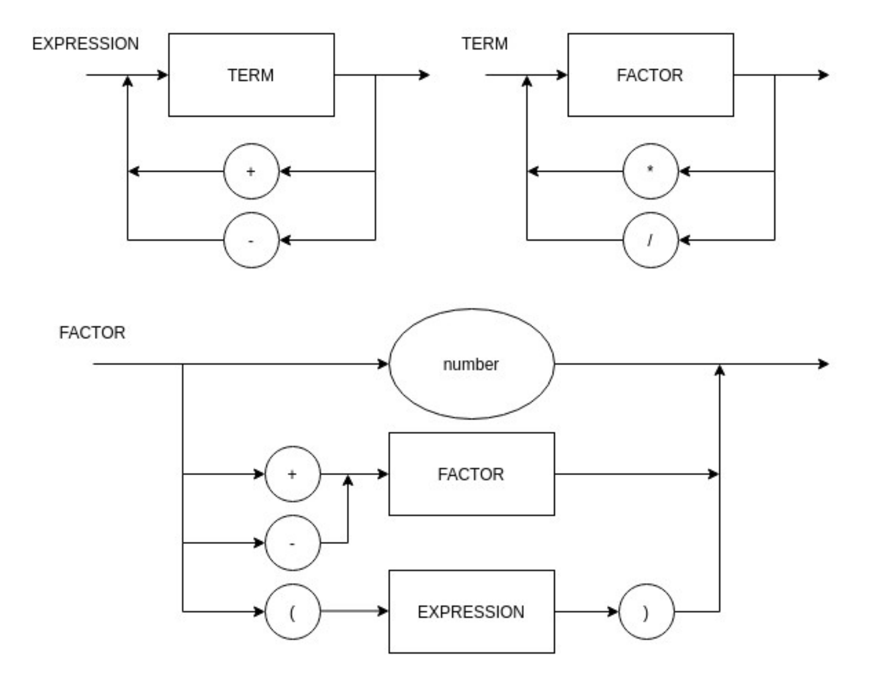

# Compilador

### Funcionamento do compilador:

Esse compilador funciona somente para argumentos de entrada que buscam calcular operações matemáticas de soma, subtração, multiplicação e divisão. O programa deve ser executado da seguinte forma:

~~~
python main.py "arquivo.c"
~~~

Sendo ```arquivo.c``` o arquivo que contém a equação a ser resolvida. Assim o programa exibirá na tela como saída o resultado da equação, que no exemplo anterior é 2.

Caso na string de entrada haja caractéres que não sejam números, sinais de soma, subtração, multiplicação, divisão, parênteses devidamente balanceados ou espaços o programa não exibirá um resultado como saída. Nesse caso, o que será exibido é um aviso de que o programa falhou e tentará encaminhar o usuário para a resolução do problema.

### Diagrama Sintático:



### Notação EBNF:


### EBNF Atual:

~~~
EXPRESSION = TERM, { ("+" | "-"), TERM } ;

TERM = FACTOR, { ("*" | "/"), FACTOR } ;

FACTOR = ("+" | "-"), FACTOR | "(", EXPRESSION,")" | NUMBER ;

NUMBER = DIGIT, {DIGIT} ;

DIGIT = DIGIT = 0 | 1 | 2 | 3 | 4 | 5 | 6 | 7 | 8 | 9 ;
~~~